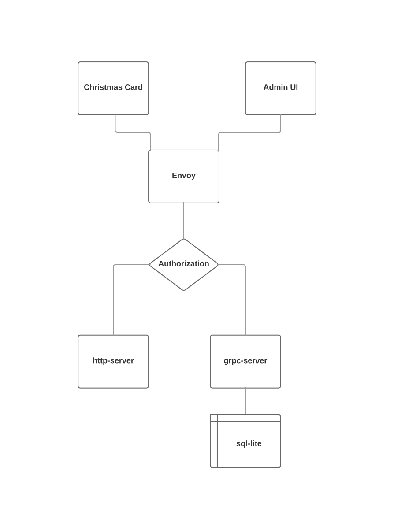
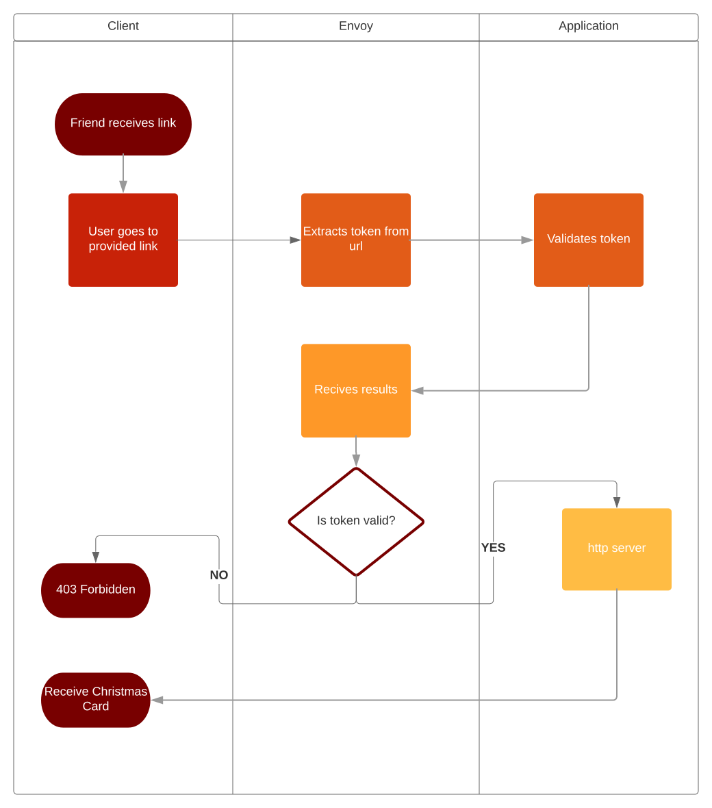

# Christmas Card Project
This project is a Christmas Card Application using react, grpc-web and grpc.
The current iteration of the server is made using node although the plan is to
convert it to golang.

# Dependencies
This application requires you have the following on a
linux based system in order to run.
* docker
* docker-compose
* internet connectection

# How to use this project
If you would like to use this project first run the following:

```bash
./install.sh
```

This installs all the required dependencies in order to run this project. That
includes required docker images and node_modules.

If you would like to rebuild the frontend then run
the following:

```bash
./build.sh
```

Last run the following to start up the application:
```bash
docker-compose up -d
```

# Design

### Architecture


### Admin Process


### Friend Process

